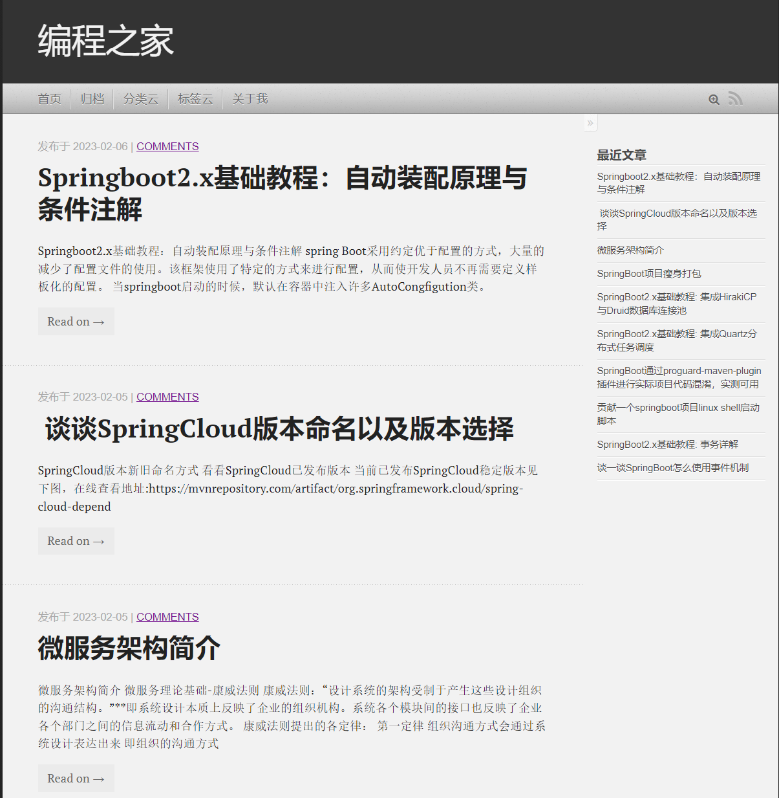
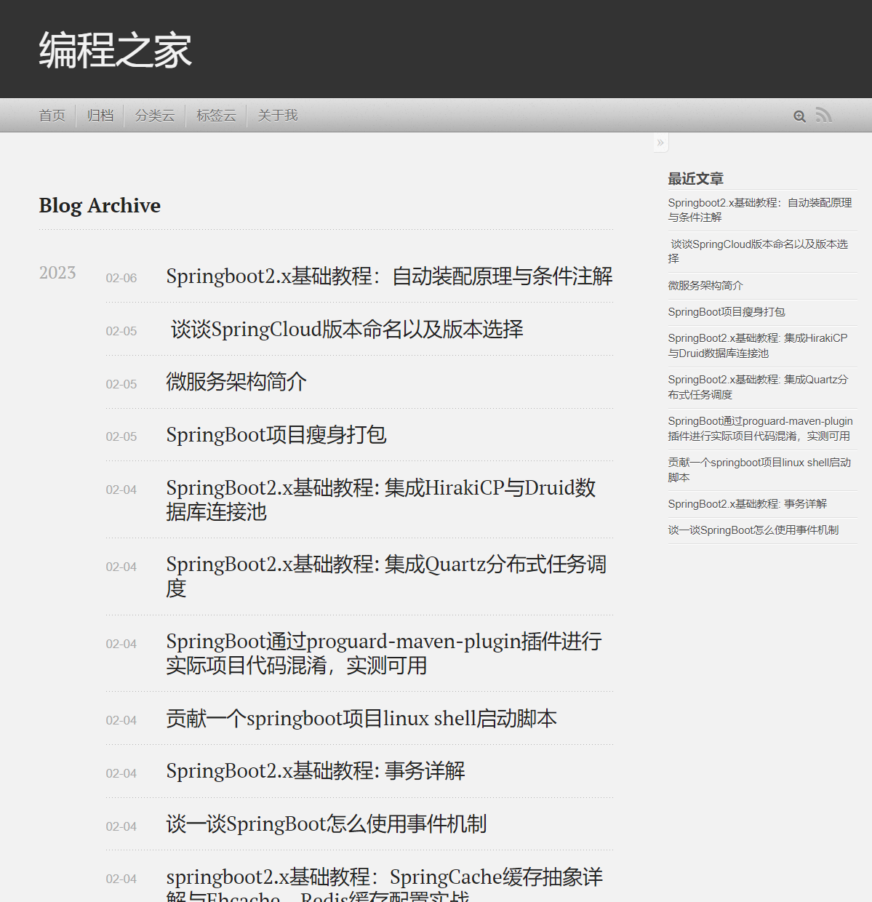

# 说明

Halo 2.0 Geek主题，本主题参考Octopress，关注文章内容，极客风格

## 😃 预览
DEMO：[https://www.codehome.vip](https://www.codehome.vip)
截图：

## ⚡ 功能

点击查看完整功能列表

- [x] halo2.x模板适配
- [x] 社交媒体
- [x] 标签、分类云
- [x] 搜索组件适配
- [x] 评论组件适配
- [x] Rss默认显示
- [x] 代码高亮
- [x] 移动客户端适配
  
## 本地安装
1. 点击链接[下载](https://github.com/mytianya/halo-theme-geek/releases)
2. 进入 Halo 后台 -> 外观 -> 主题
3. 点击右上角 “切换主题”， 在弹出的窗口中选择 “安装主题”
4. 选择下载好的主题包（zip）
5. 安装完成后的主题将会出现在 “未安装” 内，点击启用主题
